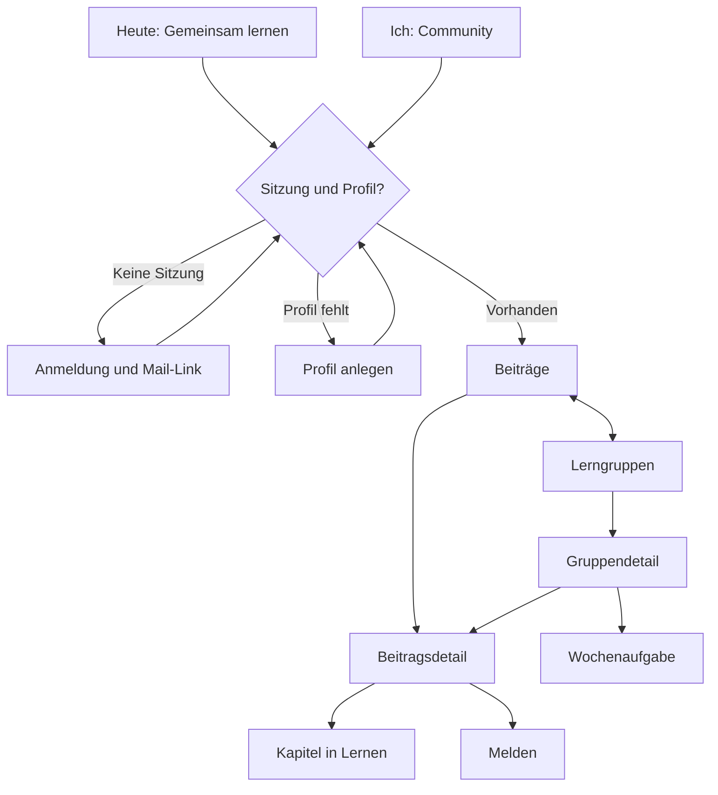

# 01 · Übersicht der Community-Bildschirme

> Status: SPEC · Version: 3 · Stand: 2026-10-08 · Autor: ChatGPT

> **Teamvertrag**
> Vorheriger Beitrag: Claude – Backend-Übergabe vom 2026-10-08; Lukes – Rollen, separates Repository und Klassen-Beta freigegeben.
> Meine Rolle jetzt: Spec – Design, Navigation, Ideen und Texte; kein Anwendungscode.
> Meine Grundlage: EinsSkill/AzubiPass-Social, gelesener Branch main; uebergabe.md, PRODUCT.md, DESIGN.md, 00-vorlage.md, entscheidungen.md, AGENTS.md und supabase/README.md. Nachgewiesener Übergabe-Commit: 7733c6f6f98a050c3fcf7558f080d3c74614dd6a. Second Brain: _System/SCHEMA.md (2026-08-20), Business/AzubiPass.md (2026-08-16).
> Nächste Übergabe an: Lukes zur Entscheidung und Freigabe dieser Version; anschließend Claude zur Umsetzung des freigegebenen Umfangs.

> **Freigabestand vom 2026-10-08:** Lukes hat Ich → Community, vier Haupttabs, den konkreten Heute-Abschnitt und die acht Community-Regeln ausdrücklich bestätigt. Der Regeltext steht in 03-community-regeln.md. Die übrige Bildschirmübersicht bleibt ein Plan für spätere Detail-Specs. Kein Merge oder Deployment freigegeben.
> **Aktueller Technikabgleich:** Neue Claude-Übergabe und quellen/community.js auf main gelesen; zugehöriger Commit 3386b94d42750531a75632621520ba1e199b1e31. Anmeldung unterstützt zusätzlich einen sechsstelligen E-Mail-Code. Claudes Testbericht wurde gelesen, nicht selbst ausgeführt. Diese Ergänzung ersetzt die ältere reine Mail-Link-Annahme.

## 1. Zweck

Die Community verbindet fachlichen Austausch, gemeinsame Lerngruppen und konkrete Lernhandlungen innerhalb der bestehenden AzubiPass-App.

Diese Datei beschreibt die vollständige Bildschirmarchitektur des in uebergabe.md genannten Funktionsumfangs. Nur Anmeldung und Profilanlage sind bereits als Detail-Spec in [02-anmeldung-profil.md](02-anmeldung-profil.md) ausgearbeitet. Die übrigen Zeilen sind ein Plan für folgende Bildschirm-Specs, keine pauschale Implementierungsfreigabe.

## 2. Einstieg

### Hauptnavigation – von Lukes am 2026-10-08 im Chat bestätigt

Die vier bestehenden Haupttabs bleiben erhalten. Unter **Ich** führt eine deutlich beschriftete Zeile **Community** in den sozialen Bereich. Innerhalb der Community gibt es die lokale Navigation **Beiträge | Lerngruppen**. Sie ist keine zusätzliche globale Tab-Leiste. Auf Unterseiten ersetzt eine Zurück-Navigation diese lokale Auswahl; der jeweilige Bereich bleibt erkennbar.

| Haupttab | Ziel | Bezug zur Community |
|---|---|---|
| Heute | Bestehender Lernstart | Kompakter Community-Einstieg und bei berechtigtem Zugriff eine laufende Wochenaufgabe; Ausgestaltung unten |
| Lernen | Bestehende Lernfelder und Kapitel | Community-Verweise öffnen das zugeordnete Kapitel; kein Konto zum Lernen erforderlich |
| Üben | Bestehende Übungsangebote und Probeklausur | Bleibt unabhängig von Community-Anmeldung und Netzverbindung |
| Ich | Bestehende lokale Einstellungen und Lernstand | Zeile Community; Profil/Konto gehören innerhalb der Community hinter Profil |

**Entscheidung:** Lukes bestätigt Ich → Community und wünscht zusätzlich Community auf Heute. Vier Haupttabs bleiben bestehen. Die Entscheidung gilt als im Chat getroffen; entscheidungen.md wurde von ChatGPT nicht verändert. Auch die folgende konkrete Heute-Gestaltung wurde von Lukes anschließend ausdrücklich freigegeben.

### Community auf Heute – freigegebene Ausgestaltung

- Position: ein kompakter Abschnitt nach den bestehenden persönlichen Lernaktionen. Lernfortsetzung und Üben behalten Vorrang. Keine neue Dashboard-Kachel und kein Feed auf Heute.
- Immer sichtbarer Einstieg: Überschrift „Gemeinsam lernen“, Link „Zur Community“. Ohne Sitzung oder Profil keine Community-Daten laden; der Link führt durch die Zugangsprüfung aus Datei 02.
- Mit Profil und Internet: höchstens eine zugängliche, aktuell laufende, noch nicht selbst erledigte Wochenaufgabe anzeigen. Bereits vorhandene Laufzeit und Erledigt-Information verwenden. Nächstes Laufzeitende zuerst; bei Gleichstand alphabetisch nach vorhandenem Aufgabentitel, dann vorhandener Kennung. Keine neue Prioritätsspalte.
- Zeile: vorhandener Aufgabentitel, zugehörige Gruppe nur bei Leserecht, Laufzeitende und Aktion „Aufgabe ansehen“. Diese öffnet C11; kein Abhaken direkt auf Heute.
- Keine passende Aufgabe: nur „Zur Community“ und „Fragen stellen, Wissen teilen und gemeinsam lernen.“ Keine Nullzähler oder unerledigten Ersatzaufgaben.
- Aufgabenfunktion noch nicht ausgeliefert: derselbe einfache Einstieg bleibt nutzbar. Der Heute-Bereich setzt nicht die vorgezogene Umsetzung von Wochenaufgaben voraus.
- Lädt: nur diese kleine Zeile zeigt „Wochenaufgabe wird geladen …“. Der Lernstart wartet nicht auf die Community-Abfrage.
- Offline: keine privaten Aufgabendetails aus einem alten Cache zeigen. „Community braucht Internet. Lernen und Üben bleiben verfügbar.“ Link zum Community-Offline-Zustand bleibt erreichbar.
- Fehler: „Die Wochenaufgabe konnte nicht geladen werden.“ Dazu „Erneut versuchen“ und der Community-Einstieg; keine Unterbrechung des Lernens.
- Beim Wechsel aus Heute in die Community wird Ich zum aktiven globalen Tab. Browser-Zurück führt zurück zu Heute. Nach Logout oder entzogenem Zugriff keine alten Aufgabendetails behalten.
- Keine neuen Datenfelder, keine ungelesen-Zähler, keine Mitteilungspflicht und kein automatischer Lernstands-Upload.

### Zugang und Rückkehr

- Ohne Sitzung: Community-Einstieg zeigt Anmeldung, keine Vorschau fremder Beiträge.
- Mit Sitzung, ohne Profil: Profil anlegen; keine Community-Inhalte sichtbar.
- Mit Sitzung und Profil: Beiträge, beziehungsweise zulässiges ursprüngliches Ziel.
- Geschützter Direktlink: Ziel während Anmeldung merken, erst nach erneuter Rechteprüfung öffnen. Nie allein anhand eines Links Zugriff gewähren.
- Wechsel zu Lernen/Üben bleibt jederzeit möglich. Beim Rückweg zur Community zuletzt geöffneten Bereich innerhalb der Sitzung wiederherstellen, sofern weiterhin erlaubt.
- Abmeldung entfernt sichtbare Community-Daten; lokale Lerndaten bleiben erhalten.

## 3. Aufbau von oben nach unten

### Gemeinsame Oberfläche

1. Bestehende tiefgrüne App-Hülle und Kopfbereich mit Titel, bei Unterseiten Zurück.
2. Kurzer Orientierungstext nur dort, wo er für die nächste Handlung nötig ist.
3. Auf den Community-Hauptansichten lokale Auswahl Beiträge und Lerngruppen; Profil als beschriftete Aktion im Kopf.
4. Inhaltsbereich als offene Liste mit feinen Trennlinien, auf Details als ruhige Lesefläche innerhalb der App-Hülle.
5. Kontextuelle Hauptaktion, zum Beispiel Beitrag schreiben oder Gruppe gründen. Keine Sammlung beliebiger Dashboard-Kacheln.
6. Bestehende globale Vierer-Tab-Leiste; Ich bleibt beim empfohlenen Einstieg aktiv.

Farben und Schriften werden aus DESIGN.md übernommen: #12301F App-Grund, #1B4332 Aktionen, #2A5A44 aktive Grünabstufung, #C9A227 Orientierung, #E3C558 Fokus, #F5F5F0 heller Text, #FBFBF8 Lesefläche. Source Serif 4 für Titel/Inhalte, IBM Plex Sans für Bedienung, IBM Plex Mono für kurze Metadaten. Goldtext auf Creme ist kein Standard. Vorhandene Komponentengeometrie übernehmen; keine zweite Gestaltungssprache.

### Vollständiges Bildschirmverzeichnis

Die Kennungen C01–C18 beschreiben Ansichten oder klar abgegrenzte Dialoge, keine neuen Datenobjekte oder festgelegten URL-Routen.

| ID | Bildschirm / Teilansicht | Einstieg | Inhalt und nächstes Ziel |
|---|---|---|---|
| C01 | Anmeldung | Ich → Community, geschützter Direktlink | E-Mail eingeben → C02; ohne Konto weiterlernen |
| C02 | Mail versendet / Link oder Code prüfen | C01, Link aus Mail | Versandhinweis, sechsstelligen Code aus derselben Mail alternativ eingeben, erneuter Versand, Adresse ändern; gültige Sitzung → C03 oder ursprüngliches zulässiges Ziel; Fehler → C01 |
| C03 | Profil anlegen | Gültige Sitzung ohne Profil | Beta-Code, Anzeigename, optional Lehrjahr, zwei Bestätigungen → C04 oder zulässiges Ziel; Detail-Spec 02 |
| C04 | Beiträge | Community nach Zugang, lokale Navigation | Für alle sichtbare Beiträge mit Art und ggf. Lernfeld; Art-/Lernfeldfilter als UI-Vorschlag; Beitrag → C05; Schreiben → C06 |
| C05 | Beitragsdetail | C04 oder C09 | Lernzettel/Frage/Tipp, ggf. zugelassene Datei, Antworten, Hilfreich, Melden; bei Frage beste Antwort durch Fragesteller; zugeordnetes Kapitel → Lernen |
| C06 | Beitrag schreiben | C04 oder C09 | Art wählen, Titel/Text, optional Lernfeld/Kapitel; bei Lernzettel Bild/PDF bis 5 MB, bei Frage Mentor:innen-Option; Ziel vor Absenden klar anzeigen → C05 |
| C07 | Lerngruppen | Lokale Navigation | Eigene Gruppen und zugängliche offene Gruppen als getrennte Listenabschnitte; Gruppe → C09; Code → C08; Gründen → C10 |
| C08 | Gruppe per Code beitreten | C07 | 8-stelligen Code eingeben; Erfolg → C09; keine Mitglieder-/Inhaltsvorschau geschlossener Gruppen vor Beitritt |
| C09 | Gruppendetail | C07, C08, C10 | Gruppenname/Beschreibung, Mitgliedschaft; für Mitglieder Bereiche Beiträge und Wochenaufgaben; offene Gruppe zunächst mit Beitreten; Schreiben → C06; Aufgabe → C11 |
| C10 | Gruppe gründen | C07 | Name 3–60, Beschreibung bis 500, offen/geschlossen → C09; Limit 10 gegründete Gruppen |
| C11 | Wochenaufgabe ansehen | C09; ggf. allgemeiner Bereich bei bestätigtem Backend-Scope | Aufgabe und Laufzeit, eigene Erledigt-Markierung, tatsächliche Anzahl erledigter Teilnahmen; keine Rangliste; zurück → Ursprung |
| C12 | Wochenaufgabe anlegen | C09 für Leitung; zulässiger Team-Kontext | Bestehende Aufgabenfelder und Laufzeit höchstens 31 Tage; genaue Felder vor Detail-Spec im Schema prüfen → C11 |
| C13 | Melden | C05, Antwortmenü | Grund wählen, absenden → Ursprung mit Bestätigung; keine Anzeige, wie viele Meldungen zum Ausblenden fehlen |
| C14 | Moderation | Profil für team | Meldungen und ausgeblendete Inhalte im tatsächlich erlaubten Umfang; prüfen, aus-/einblenden → aktualisierte Moderationsliste |
| C15 | Eigenes Community-Profil / Konto | Kopfaktion Profil | Anzeigename, optional Lehrjahr, zugewiesene Rolle; Abmelden → C01; ggf. Moderation → C14. Profilbearbeitung erst nach Rechteprüfung gesondert spezifizieren |
| C16 | Gruppeninformationen / Verlassen | C09 | Offen/geschlossen und vorhandene Informationen; Beitrittscode nur nach bestätigtem Leserecht; Verlassen bestätigen → C07 |
| C17 | Community-Regeln | C03, Profil | Gültige Regeltexte lesen, zurück zum vorherigen Formular ohne Verlust der Eingaben; freigegebenen Regeltext aus 03-community-regeln.md verwenden |
| C18 | Offline / kein Zugriff / nicht verfügbar | Jede geschützte Ansicht | Passender Zustand statt verdeckter Inhalte; Erneut versuchen oder Zu Lernen; Anmeldung nur bei fehlender/abgelaufener Sitzung |

### Zusammenhänge

Direktlinks können nach dem Zugang anstelle von Beiträge das berechtigte Ziel öffnen. Moderatorenzugang ist zusätzlich an team gebunden. Die Grafik zeigt die Kernwege; Dialoge und Profilaktionen sind vollständig in der Tabelle beschrieben.

## 4. Aktionen

| Aktion | Wer darf | Was passiert danach |
|---|---|---|
| Lernen oder Üben öffnen | Alle | Bestehender Offline-Lernbereich; kein Community-Konto nötig |
| Community lesen | Sitzung mit Profil; gruppenabhängige Rechte zusätzlich | C04/C05 beziehungsweise erlaubter Gruppeninhalt |
| Beitrag oder Antwort absenden | Profil und passende Schreibrechte | Erfolg erst nach Serverbestätigung; Eingaben bei Fehler erhalten |
| Beste Antwort markieren | Autor der Frage gemäß Backend | Zugehörige Antwort hervorgehoben, Frage als gelöst; kein Punktestand |
| Hilfreich markieren | Berechtigtes Profil | Eine Markierung pro Person und Beitrag; keine Doppelzählung; Rücknahme nur bei bestehender Backend-Unterstützung |
| Frage an Mentor:innen richten | Berechtigter Fragesteller | Vorhandene Option am Beitrag; kein Direktchat und kein Antwortversprechen |
| Gruppe gründen | Profil, weniger als 10 gegründete Gruppen | Gründer erhält leitung, Gruppe öffnet |
| Offen oder per Code beitreten | Profil und serverseitig zulässiger Zugang | Mitgliedschaft bestätigt, Gruppe öffnet |
| Gruppe verlassen | Mitglied nach Backend-Regeln | Bestätigung, anschließend C07; Sonderfall letzte Leitung vor Detail-Spec klären |
| Wochenaufgabe erstellen | Gruppenleitung im eigenen Kontext oder team nach vorhandenen Rechten | Aufgabe erscheint am erlaubten Ort |
| Wochenaufgabe abhaken | Berechtigtes Mitglied/Profil im Aufgabenkontext | Eigene Erledigung und reale Anzahl aktualisieren; Wiederholungen nicht doppelt zählen |
| Inhalt melden | Profil und zulässiger Zugriff | Bestätigung; drei Meldungen führen laut Backend zur vorläufigen Ausblendung |
| Moderieren | team | Aus-/Einblenden entsprechend bestehender RPC-Rechte |
| Abmelden | Angemeldete Person | Community-Zugriff geschlossen; lokaler Lernfortschritt unverändert |

Oberflächenlogik ersetzt niemals RLS/RPC-Prüfungen. Rollen sind keine auswählbaren Profilfelder. Mentor:innen werden vom Team zugewiesen; team ausschließlich in der Datenbank. Rate-Limits aus der Übergabe: 20 Beiträge, 60 Antworten und 30 Meldungen pro Stunde; keine Restkontingente als Motivationsanzeige.

## 5. Zustände

- **Leer:** Beiträge: „Hier gibt es noch keine Beiträge. Stell eine Frage oder teile einen Tipp.“ Gruppen: „Du bist noch in keiner Lerngruppe.“ Filter ohne Treffer: „Zu diesen Filtern gibt es keine Beiträge.“ Kein erfundener Beispielinhalt als echter Beitrag.
- **Lädt:** „Community wird geladen …“ beziehungsweise „Beitrag wird geladen …“; vorhandene Ansicht nicht durch erfundene Zähler ersetzen. Schreibaktionen während derselben Anfrage vor Doppelklick schützen.
- **Fehler:** Laden: „Das hat gerade nicht geklappt. Versuch es erneut.“ Schreiben: „Dein Beitrag wurde nicht gesendet. Deine Eingaben sind noch da.“ Limit: „Du hast gerade viele Beiträge gesendet. Versuch es später erneut.“ Für Antworten/Meldungen Substantiv entsprechend anpassen. Keine Rohdatenbankfehler anzeigen.
- **Offline:** „Du bist offline. Für die Community brauchst du Internet. Lernen und Üben kannst du weiter nutzen.“ Keine versprochenen Hintergrundsendungen. Noch nicht gesendete Eingaben während der geöffneten Ansicht erhalten, aber nicht als gespeichert ausgeben. Private Community-Daten nicht in den allgemeinen Offline-Cache aufnehmen.
- **Ohne Profil / ohne Berechtigung:** Fehlende Sitzung → C01; fehlendes Profil → C03; sonst „Dieser Inhalt ist für dich nicht verfügbar.“ Kein Titel, Autor, Dateiname oder Meldungsgrund eines unzugänglichen Inhalts. Ausgeblendete Inhalte aus der Ansicht entfernen, sobald der neue Status bekannt ist.
- **Sitzung abgelaufen:** „Deine Anmeldung ist abgelaufen. Melde dich erneut an.“ Schreibvorgang nicht automatisch erneut auslösen; nach Rückkehr Rechte und Daten prüfen.
- **Veraltetes Ziel:** Verlassene Gruppe, entzogener Zugriff oder verschwundener Inhalt führen zu C18 mit Rückweg. Browser-Zurück darf keine bereits entzogenen Inhalte erneut sichtbar machen.

## 6. Texte (wörtlich)

| Stelle | Text |
|---|---|
| Einstieg unter Ich | Community |
| Unterzeile | Fragen stellen, Wissen teilen und gemeinsam lernen. |
| Lokale Navigation | Beiträge / Lerngruppen |
| Kopfaktion | Profil |
| Hauptaktion Beiträge | Beitrag schreiben |
| Beitragsarten | Lernzettel / Frage / Tipp |
| Beitragsziel allgemein | Für alle in der Community |
| Beitragsziel Gruppe | Für Mitglieder dieser Gruppe |
| Mentor:innen-Option | Frage an Mentor:innen richten |
| Antwortaktion | Antworten |
| Lösung | Als beste Antwort markieren |
| Lösungsstatus | Gelöst |
| Reaktion | Hilfreich |
| Gruppenaktionen | Gruppe gründen / Mit Code beitreten / Beitreten / Gruppe verlassen |
| Aufgabenbereich | Wochenaufgaben |
| Aufgabenaktion | Als erledigt markieren |
| Aufgabenanzahl | {Anzahl} erledigt |
| Meldung | Inhalt melden |
| Meldegründe | Fachlich falsch / Urheberrecht / Beleidigung / Spam / Persönliche Daten / Sonstiges |
| Meldebestätigung | Danke. Das Team prüft deine Meldung. |
| Uploadhinweis | Lade nur Inhalte hoch, die du teilen darfst. Keine echten IHK-Prüfungsaufgaben und keine persönlichen Daten anderer Personen. |
| Offline-Rückweg | Zu Lernen |
| Wiederholen | Erneut versuchen |

Geschlossene Gruppen werden nicht als vertraulicher oder verschlüsselter Chat beworben. Rollenkennzeichen beschreiben zugewiesene Rollen, keine amtliche Prüfung fachlicher Aussagen.

## 7. Daten

| Bereich | Bereits in uebergabe.md vorhanden |
|---|---|
| Zugang/Profil | Mail-Link oder sechsstelliger E-Mail-Code, Beta-Code, eindeutiger Anzeigename 2–30, optional Lehrjahr 1–3, Alter mindestens 16 bestätigt, Community-Regeln bestätigt, zugewiesene Rolle |
| Gruppen | Name 3–60, Beschreibung bis 500, offen/geschlossen, 8-stelliger Beitrittscode, Mitgliedschaft, leitung/mitglied, Grenze 10 gegründete Gruppen |
| Beiträge | Art lernzettel/frage/tipp, Titel 3–120, Text bis 4000, optional Lernfeld/Kapitel, Ziel alle/Gruppe, Bild/PDF bis 5 MB für Lernzettel, Mentor:innen-Option für Fragen |
| Antworten/Reaktion | Antwort bis 2000, beste Antwort/gelöst, eine Hilfreich-Markierung pro Person und Beitrag |
| Wochenaufgaben | Bestehende Aufgabe, Laufzeit höchstens 31 Tage, eigene Erledigung, reale Anzahl erledigter Teilnahmen |
| Moderation | Meldungsgrund, vorläufige Ausblendung nach drei Meldungen, Teamaktion aus-/einblenden |

Es werden keine neuen Datenfelder verlangt. Filter, Zurück-Ziel und sichtbarer Bereich sind Oberflächenzustände. Exakte Spalten, RPC-Signaturen, Sortiermöglichkeiten, Leserechte für Beitrittscodes und Aufgabenfelder muss Claude gegen die vorhandenen Migrationen prüfen. Keine Datenbankänderung zur stillen Anpassung an diese Übersicht.

Nicht enthalten: Direktnachrichten, Freundeslisten, Follower, Profilbilder, Biografien, Online-Status, Push-Mitteilungen, öffentlicher Mitgliederkatalog, Ranglisten, Punkte und Streaks. Kein impliziter Ausbau des Datenmodells durch übliche Social-Media-Erwartungen.

## 8. Barrierefreiheit

- Mobile zuerst; bei 320 CSS-px und Textvergrößerung keine horizontale Pflichtnavigation. Lange reale Titel umbrechen.
- Alle Aktionen mindestens 44 × 44 px; bestehende Fokusmarkierung mit #E3C558 auf dunklem Grund, nicht nur Farbwechsel.
- Fokusfolge: Kopf/Zurück, lokale Navigation, Filter, Hauptinhalt, Aktionen; visuelle und Tastaturreihenfolge stimmen überein.
- Semantische Überschriften und Listen. Haupt-/lokale Navigation eindeutig benennen; aktives Ziel auch für Bildschirmleser auszeichnen.
- Gelöst, hilfreich, Rollen und Fehler erhalten Text; Farbe allein vermittelt keinen Zustand.
- Dialoge halten Fokus, unterstützen Escape und geben Fokus an ihren Auslöser zurück. Bestätigungen werden angekündigt, ohne den Fokus unerwartet zu verschieben.
- Lange Formulare bleiben bei geöffneter Bildschirmtastatur bedienbar. Tab-Leiste verdeckt weder Felder noch Fehlermeldungen.
- Ladeanzeigen ohne zwingende Animation; reduzierte Bewegung respektieren. Kontrast für tatsächlich verwendete Kombinationen prüfen.
- Hochgeladene PDFs/Bilder können unzugänglich sein: Titel und Beitragstext bleiben lesbar; keine Barrierefreiheit fremder Dateien versprechen.

## 9. Offene Fragen an Lukes

Für den jetzigen Übergabeschritt sind Navigation, konkrete Heute-Gestaltung und Community-Regeltext entschieden. Nicht erneut abfragen. Der Regeltext ist in [03-community-regeln.md](03-community-regeln.md) enthalten.

Für spätere Arbeit offen: Reihenfolge der weiteren Detail-Specs. Vorschlag: Beiträge/Fragen/Antworten einschließlich Melden und Moderation, anschließend Gruppen und Wochenaufgaben. SMTP-Einrichtung vor Klassenversand bleibt ein gesonderter operativer Schritt; Konto löschen ist nicht Teil dieser Freigabe.

### Übergabe an Claude

Nach Lukes' Eintrag in entscheidungen.md nur die ausdrücklich freigegebene Version umsetzen. Zunächst Zugang und Profil aus Datei 02 samt ausgewähltem Einstieg bauen; die Übersicht ist der Navigationsplan für nachfolgende Bildschirm-Specs. Nicht alle C01–C18 allein aufgrund dieser Tabelle implementieren.

Vorher main/Commit und git status --short prüfen, fremde Änderungen erhalten und aktuellen Abschnitt in uebergabe.md lesen. Die gelesene alte README nennt „keine Nutzerkonten“; die neuere freigegebene Community-Entscheidung verlangt Mail-Anmeldung. Den Geltungsbereich klarstellen: Lernen bleibt lokal ohne Konto; Community benötigt Konto/Profil und Internet. Keine kommerziellen Annahmen aus der separaten Schulaufgabe übernehmen.

Das tatsächliche Schema wurde in dieser Spec nicht ausgeführt oder umfassend geprüft. Offene Backend-Abgleiche: RPC-Parameter/Fehler, Sichtbarkeit offener Gruppen, Code-Leserecht, letzte Gruppenleitung beim Verlassen, Scope und Felder von Team-Wochenaufgaben, Rücknahme von Hilfreich/Erledigt. Abweichungen melden, nicht das Modell eigenmächtig erweitern.

Nach Umsetzung: geänderte Dateien und Commit nennen, Ergebnisse der vorhandenen Prüfungen und der Zugangsfälle aus Datei 02 belegen, dann ChatGPT zum Review übergeben. Keine Merge-/Live-Freigabe ist mit dieser SPEC erteilt.

Vorgeschlagener Briefkasteneintrag für die spätere Übernahme durch Lukes oder Claude: „2026-10-08 · ChatGPT → Lukes: 01-uebersicht.md und 02-anmeldung-profil.md, Version 3: Navigation, Heute-Gestaltung und Regeltext im Chat freigegeben; neue Mail-Code-Unterstützung mit Claudes Datenschicht abgeglichen. Nächster Schritt: Lukes entscheidet und dokumentiert die freigegebene Version; Claude implementiert danach den freigegebenen Umfang.“

**Lieferstatus:** Zwei externe Markdown-Entwürfe zum Einlegen unter doku/community/. Kein Repo- oder Second-Brain-Schreibzugriff vorgenommen, kein Arbeitsbaum von Claude verändert, keine Tests/Commits/Deployments durch ChatGPT ausgeführt. Der lokale git status von Claudes Arbeitsbaum ist nicht zugänglich.
